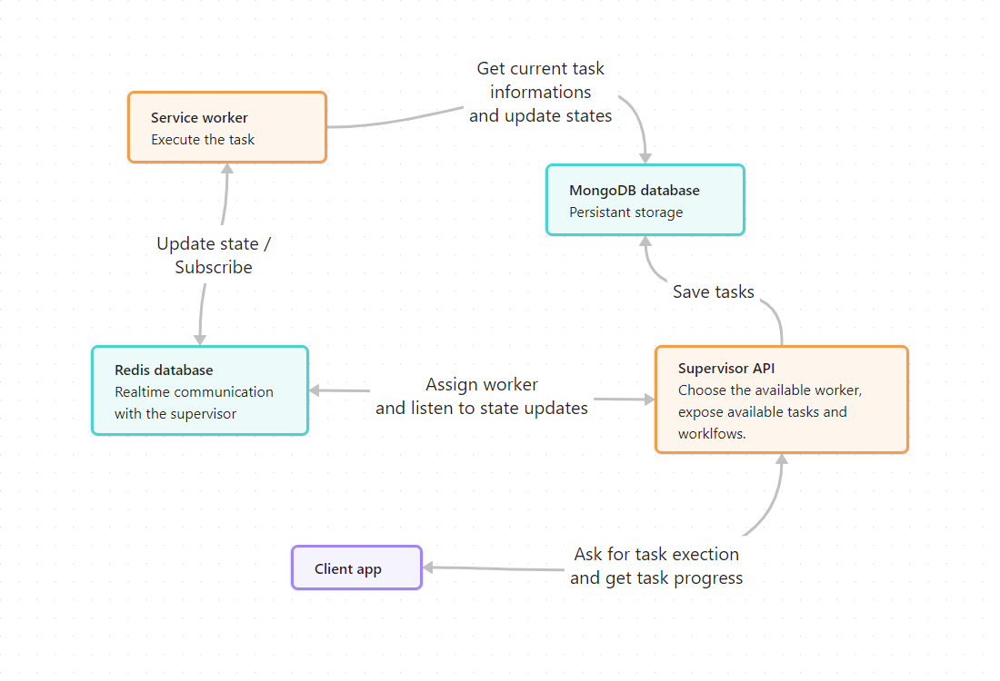

# Automation
No-code solution to create workflow automation based on a node editor.

Objectives:

- Create tasks based on various technical packages.
- Create workflows composed of tasks and sub-workflows connected to each other.
	- During the execution of a workflow, pass the result of a node to each connected node.
	- Flexible data handling while still supporting typed task results.
- Order tasks and workflows by scopes.
- Provide context on scope, tasks, and workflows to allow complex settings.

Backend Requirements:

- One supervisor that handles comms between clients and workers. Supervisor is an unique entry point for simplification sake.
- Workers that can be horizontally scaled to execute tasks.
- Fast real-time communication between workers and supervisor (as opposed to loops with delays).

## Architecture

## Getting started

- [Setting up a mongodb with docker in visual studio](https://medium.com/@hugo_cesar45/asp-net-core-web-api-net-8-docker-mongodb-8fab9a54f72c)

Start the `docker-compose` startup project for the backend.
Start `Automation.App` for the client.

## Links

- [Adonis UI](https://benruehl.github.io/adonis-ui/) for styles
- [Fontawesome](https://fontawesome.com/) icons
- [PropertyChanged.Fody](https://www.nuget.org/packages/PropertyChanged.Fody) for boilerplate
- [Nodify](https://miroiu.github.io/nodify/) for the node editor

# TODO

- Handle communication between client and supervisor with signalR
- Scripting language to handle contexte change in tasks settings
- Generic way to create UI form for settings
    - Also handle validation and types with this ?
- Display workflow progress in realtime
- Workflow validation with potential errors prompting (infinite loop. dead branches, ...)
- Handle supervisor edge case for flow control tasks
- Display workers list and allow supervision
- Add user management with roles and permissions
- Handle proper state (going back and forth with history) in the editor

# ToThink

- Allow multiple supervisor and more complex worker assignation
    - Allow a workflow to be executed by only one worker for optomizations