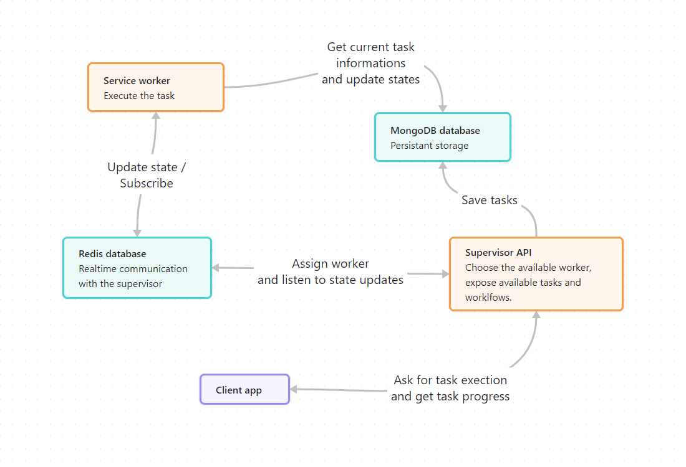

# Automation
No-code solution to create workflow automation based on a node editor.

Objectives:

- Create tasks based on various technical packages.
- Create workflows composed of tasks and sub-workflows connected to each other.
	- During the execution of a workflow, pass the result of a node to each connected node.
	- Flexible data handling while still supporting typed task results.
- Order tasks and workflows by scopes.
- Provide context on scope, tasks, and workflows to allow complex settings.

Backend Requirements:

- One supervisor that handles comms between clients and workers. Supervisor is an unique entry point for simplification sake.
- Workers that can be horizontally scaled to execute tasks.
- Fast real-time communication between workers and supervisor (as opposed to loops with delays).

## Architecture

> Note: the diagram above still shows the original distributed topology (a supervisor API and
> Redis/MongoDB-backed workers). The execution engine has since been reworked to run **in-process**
> (`Automation.Worker`), and the client talks to service interfaces backed by an in-memory
> implementation (`Automation.Services.Local`). The distributed backend has been removed; see
> [Projects](#projects) for the current layout.

## Projects

All projects live under `Automation/` (solution: `Automation/Automation.sln`) and target .NET 10.

### Contracts

- **`Automation.Plugins.Shared`** — the plugin contract. Defines `ITask` / `ITaskRuntime`,
  the `TaskNotification` type and the `BaseTask` / `BasePassThroughTask` / `BaseOutputlessTask`
  base classes that package authors derive from. Has no dependencies so it can be shipped to
  plugin packages.
- **`Automation.Shared`** — the shared data model and service interfaces. Contains the scoped
  model (`Scope`, `AutomationTask`, `AutomationWorkflow`, `AutomationControl`), the graph model
  (`TasksGraph`, `GraphNode`, connectors/connections), the execution model (`TaskInstance`,
  `WorkflowInstance`, `TaskInstancesProgress`, `PackageClassTarget`) and the client-facing
  service abstractions (`IScopedService`, `IPackagesService`, `IWorkersService`,
  `IHistoryService`).

### Engine (the reworked core)

- **`Automation.Worker`** — the in-process execution engine and **source of truth** for how a
  workflow runs. `LocalWorkflowExecutor` walks the graph (branching, wait-for-all-inputs,
  pass-through, stop-at-first-end), `LocalNodeExecutor` runs a single node, `TaskLoader` /
  `LocalPackageManagement` load and cache task DLLs from a local NuGet feed. Progress and state
  changes are surfaced through in-memory `IProgress<>` callbacks (`TaskInstancesProgress`) — no
  database or message broker involved.
- **`Automation.Plugins`** — sample/test task plugins (`TestTask`, `ConditionalTask`,
  `PassThroughTask`, `TestDelay`, …) built on the current `ITask` contract. Used to exercise the
  engine.
- **`Automation.Worker.Console`** — a console harness that builds a workflow graph, wires up the
  sample plugins and runs it through `LocalWorkflowExecutor`. This is the manual test entry point
  for the engine rework.

### Services & client

- **`Automation.Services.Local`** — in-memory / local implementations of the `Automation.Shared`
  service interfaces (`LocalScopedService`, `LocalPackagesService`, `LocalWorkersService`,
  `LocalHistoryService`). Backs the app with mock/seeded data (and the real local package feed via
  `LocalPackageManagement`) until a persistent backend exists.
- **`Automation.App`** — the WPF client (node editor, workflows, history, packages and workers
  pages). Consumes only the `Automation.Shared` service interfaces, resolved to
  `Automation.Services.Local`.

### Legacy / unused

- **`Automation.Realtime`** — Redis-based worker registry and pub/sub used by the old distributed
  backend. Only the `WorkersRealtimeClient` part is self-consistent; the state/notification
  publishers reference types that were removed during the rework. It is **not referenced by any
  active project** and is kept only as a reference for a future distributed setup.
- **`docker-compose` (mongo + redis)** — scaffolding for the former distributed backend; currently
  unused by any project.

> Removed during the engine rework: **`Automation.Supervisor.Api`** (the supervisor REST/SignalR
> API) and **`Automation.Worker.Service`** (the hosted worker). Both were still built on the old
> MongoDB DAL (`Automation.Dal`) and domain models (`Automation.Models`) that no longer exist, so
> they no longer compiled against the reworked engine.

## Getting started

The engine now runs in-process, so no database or broker is required to try it out:

- Run **`Automation.Worker.Console`** to execute a sample workflow through the engine.
- Run **`Automation.App`** for the WPF client (backed by `Automation.Services.Local`).

## Links

- [Adonis UI](https://benruehl.github.io/adonis-ui/) for styles
- [Fontawesome](https://fontawesome.com/) icons
- [PropertyChanged.Fody](https://www.nuget.org/packages/PropertyChanged.Fody) for boilerplate
- [Nodify](https://miroiu.github.io/nodify/) for the node editor

# TODO

- Handle communication between client and supervisor with signalR
    - Display workflow progress in realtime
- Scripting language to handle contexte change in tasks settings
- Generic way to create UI form for settings
    - Also handle validation and types with this ?
- Handle supervisor edge case for flow control tasks
- Add user management with roles and permissions
- Handle proper state (going back and forth with history) in the editor
- handle read and write tasks in the interface
- Supervisor

- Display workers list and allow supervision
- Workflow validation with potential errors prompting (infinite loop. dead branches, ...)

# ToThink

- Allow multiple supervisor and more complex worker assignation
    - Allow a workflow to be executed by only one worker for optomizations
- optimize and simplify signalR and redis communication
- display potential errors in workflow creation